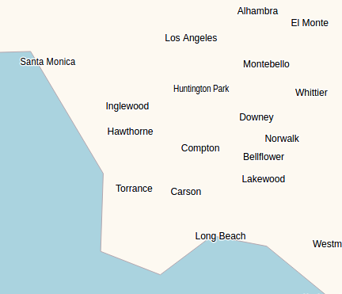
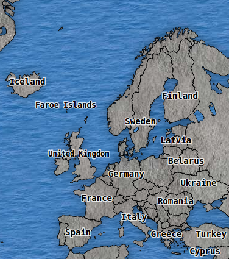
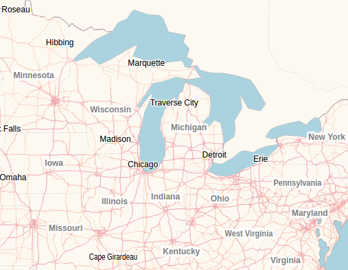
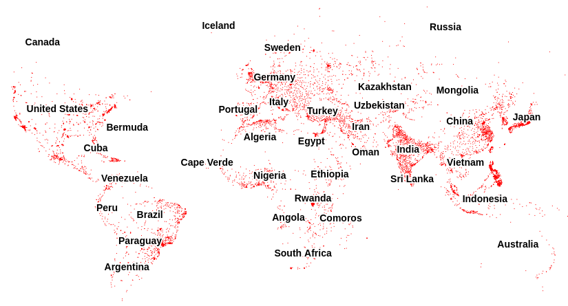

# tinyworldmap

tinyworldmap is a world map for offline-first and low-bandwidth web apps.

[Nightly demo](https://tinyworldmap.com/beta) | [Stable demo](https://tinyworldmap.com) | [v3 announcement](https://tinyworldmap.com/3)

<kbd></kbd>

tinyworldmap is designed to be used with Leaflet. All zoom levels are supported, and the most complete version is only 450 kB gzipped. Its client-side rendering has been extensively profiled and tested on low-end decade-old phones, with no discernible lag.

By default, the map displays the 10,000 most populous cities added to OpenStreetMap. At the time of writing, this encompasses all cities and towns with a population of at least 48,000:

<kbd></kbd>

## Usage

There are two ways to use the map:

1. As a base map, replacing OpenStreetMap tiles
2. As an offline fallback for OpenStreetMap tiles

### As a base map

To use tinyworldmap as a Leaflet base map, add the following to your `head` tag:

```html
<script src="https://tinyworldmap.com/dist/v3/tiny-world-all-10000.js">
```

This script embeds all data necessary to display the map.

Then, instead of adding a tile layer to the Leaflet map, use:

```js
new L.GridLayer.TinyWorld({maxZoom: 19}).addTo(map)
```

The version currently in development is also available:

```html
<script src="https://tinyworldmap.com/dist/beta/tiny-world-all-10000.js">
```

### As a fallback map

In offline-first web applications, caching image-based maps at all zoom levels is impossible due to the vast number of tiles, with a combined size often in the order of terabytes.

This repository [provides](service-worker.js) a service worker to enable offline functionality for web apps with maps.

When this service worker is installed, the fallback map is preloaded. All visited pages are cached, but the base map is excluded. While the server can be reached, cached data is not used. When the user is offline, the website is served from cache, and the service worker intercepts requests to the OSM tile server, generating replacement tiles locally using tinyworldmap.

Before [registering the service worker](https://web.dev/articles/service-workers-registration), first modify all sections in the service worker marked `IMPORTANT`. Once registered, be sure to attribute OpenStreetMap and tinyworldmap in your tile layer as follows:

```js
L.tileLayer('https://tile.openstreetmap.org/{z}/{x}/{y}.png', {
    maxZoom: 19,
    attribution: '&copy; <a href="https://www.openstreetmap.org/copyright">OpenStreetMap</a>, <a href="https://www.tinyworldmap.com">tinyworldmap</a>'
}).addTo(map);
```

To see an example of a production application using tinyworldmap as a fallback, visit [Hitchmap](https://hitchmap.com). Simply load the website in a browser supporting service workers, wait for a while, turn off your internet, and reload. The web app should be functioning as normal, using the fallback map. Note that it might take a while for the service worker to install.

## Altering the Map Appearance

The constructor takes a `render` option, which alters the appearance of the map:

<kbd></kbd>

For every layer, the options in `style` are applied to the [rendering context](https://developer.mozilla.org/en-US/docs/Web/API/CanvasRenderingContext2D). For reference, the default style can be found [here](dist/beta/styling-example.js), and the heavily styled version used in the tinyworldmap 3 [announcement](https://tinyworldmap.com/3) can be found [here](3.html#L229).

```
let render = {
    state_borders: {
        style: {fillStyle: '#f00'}
    }
}

new L.GridLayer.TinyWorld({maxZoom: 19, render}).addTo(map)
```

## Custom maps

Please contact us at [business@tinyworldmap.com](mailto:business@tinyworldmap.com?body=Hi%20Bob,) for a quote if your organization requires a road map, a city map, a map in another language, or another custom-content map featuring OSM or non-OSM data.

<kbd></kbd>

## Tinier world maps

The complete map is 450K gzipped/1.1M uncompressed. For certain use cases, this might still be too large.

### No borders

[`tiny-world-cities-10000.js(on)`](dist/v3/tiny-world-cities-10000.js) contains all the data present in the complete version except for state borders, country borders and shorelines. This reduces the gzipped version by 300k and the uncompressed version by 825k.

In addition to its smaller size, the version without borders has the advantage that all data included is precise. The country borders in the complete version are not exact at high zoom levels, which can look strange when overlaying shapes that match country borders and shorelines. In such cases, the version without borders often looks better.

This is the default styling:

<kbd></kbd>

### No cities

There are two versions available without city labels: `tiny-world-borders.js(on)` (which omits state borders) and `tiny-world-nocities.js(on)` (which retains state borders). The city labels comprise 410K uncompressed and 172K compressed.

### Fewer cities

Finally, for each file including city labels, there also exist versions featuring 2,000 cities and 4,000 cities. Simply substitute `10000` with `2000` or `4000` in the filename.

Cities included | Population
--- | ---
10,000 | > 48,000
4,000 | > 137,000
2,000 | > 287,000

## Attribution

Like OpenStreetMap data, tinyworldmap data is licensed under the ODBL, which necessitates attribution. If you've followed the steps outlined above, your Leaflet footer should include attribution to both OpenStreetMap and tinyworldmap. If not, add the following:

```html
&copy; <a href="https://www.openstreetmap.org/copyright">OpenStreetMap</a>, <a href="https://www.tinyworldmap.com">tinyworldmap</a>
```
