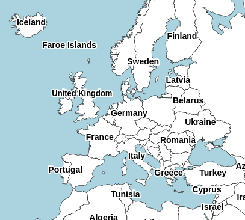
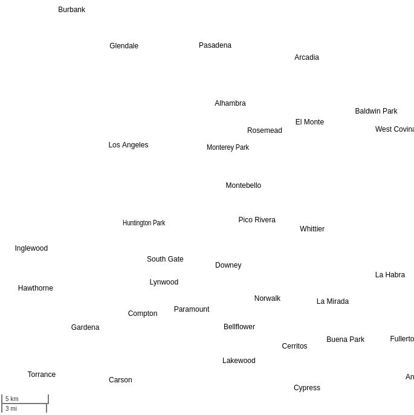

# tinyworldmap

<kbd></kbd>
<kbd></kbd>
<kbd></kbd>

[Demo]()

tinyworldmap is a world map for offline-first and low-bandwidth web apps. It's rendered client-side, and has been tested on low-end decade-old phones.

It can be used with Leaflet, supports all zoom levels, and the most complete version only takes up 277 kB gzipped.

The map includes the names and locations of the 10,000 most populous cities added to OpenStreetMap. At the time of writing, this means that all cities with at least 50,000 inhabitants are displayed.

## Usage

There are two ways the map can be used:

1. As a base map, replacing OpenStreetMap tiles
2. As an offline fallback for OpenStreetMap tiles

### As a base map

To use tinyworldmap as a Leaflet base map, add the following to your `head` tag:

```html
<script src="https://tinyworldmap.com/dist/tiny-world-all-10000.js">
```

This script embeds all necessary data to display the map.

Then, instead of adding a tile layer to the Leaflet map, use:

```js
new L.GridLayer.TinyWorld().addTo(map)
```

The `TinyWorld` constructor takes the following options: `backgroundColor`, `textColor`, `borderColor`, `borderFillColor`, `textStrokeColor` (helps separate the text from the rest), `cityFont` (e.g. `"12px Arial"`), `countryFont`, and `dotColor`.

If `dotColor` is set, every city is marked with a dot. This makes the map usable even when using a stripped-down version of tinyworldmap that doesn't include country borders:

<kbd></kbd>

### As a fallback map

In offline-first web applications, caching a map can prove to be challenging. Raster base maps consist of billions of 256x256 tiles, with a combined size of terabytes.

This repository provides a [service worker](service-worker.js) to make your maps work offline.

The strategy is simple: when the service worker is installed, the fallback map is preloaded and all visited pages are cached, but the base map is not. Cached data is never used while the user can reach the server. When offline, the cached pages are served. Furthermore, the service worker intercepts requests to the OSM tile server, generating replacement tiles locally using tinyworldmap.

Before using this service worker, alter the sections marked `IMPORTANT`, and [register the service worker](https://web.dev/articles/service-workers-registration). Attribute OpenStreetMap and tinyworldmap in your tile layer:

```js
L.tileLayer('https://tile.openstreetmap.org/{z}/{x}/{y}.png', {
    maxZoom: 19,
    attribution: '&copy; <a href="http://www.openstreetmap.org/copyright">OpenStreetMap</a>, <a href="http://www.tinyworldmap.com">tinyworldmap</a>'
}).addTo(map);
```

## Tinier world maps

The complete map is 277K gzipped/694K uncompressed. For some use cases, this is still too big.

### No borders

[`tiny-world-noborders-10000.js(on)`](tiny-world-noborders-10000.js) has all data in the complete version except for country borders and shorelines. This shaves off 100k from the gzipped version and 200k from the uncompressed version.

Besides size, the version without borders has the advantage that all data included is precise. The country borders in the complete version are not exact at high zoom levels, which can look weird if you're overlaying shapes that match country borders and shorelines. In that case, using the version without borders often looks better.

This is the default styling:

<kbd></kbd>

### No cities

If city labels are not needed, there are two versions called `tiny-world-nocities.js(on)` (which does have country labels) and `tiny-world-borders.js(on)` (which doesn't). The city labels are 410K uncompressed and 172K compressed.

### Less cities

Finally, for every file that does include city labels, there's a version with 2,000 cities, 4,000 cities, and 10,000 cities. Simply replace `10000` by `2000` or `4000` ion the file name.

Cities included | Population
--- | ---
10,000 | > 48,000
4,000 | > 137,000
2,000 | > 287,000

## Hire tinyworldmap

If you require a customized map (getting a more detailed map for part of the world, translation, etc) or if you need help getting your website to work offline, contact us at [business@tinyworldmap.com](mailto:business@tinyworldmap.com).

## Attribution

Like OpenStreetMap data, tinyworldmap data is licensed under the ODBL, which requires attribution. If you follow the steps above, you should have an attribution to both OpenStreetMap and tinyworldmap in your Leaflet footer. If not, add this:

```html
&copy; <a href="http://www.openstreetmap.org/copyright">OpenStreetMap</a>, <a href="http://www.tinyworldmap.com">tinyworldmap</a>
```
