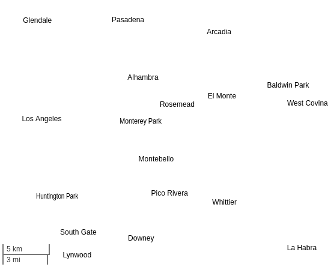

# tinyworldmap

tinyworldmap is a world map designed for offline-first and low-bandwidth web apps.

[Demo]()

<kbd></kbd>

tinyworldmap is designed to be used with Leaflet. All zoom levels are supported, and the most complete version is only 277 kB gzipped.

It's rendered client-side and has been extensively profiled and tested on low-end phones dating back a decade, with no discernible lag.

By default, the map displays the names and locations of the 10,000 most populous cities sourced from OpenStreetMap. At the time of writing, this encompasses all cities and towns with a population of at least 50,000:

<kbd></kbd>

## Usage

There are two ways to use the map:

1. As a base map, replacing OpenStreetMap tiles
2. As an offline fallback for OpenStreetMap tiles

### As a base map

To use tinyworldmap as a Leaflet base map, add the following to your `head` tag:

```html
<script src="https://tinyworldmap.com/dist/tiny-world-all-10000.js">
```

This script embeds all the data necessary to display the map.

Then, instead of adding a tile layer to the Leaflet map, use:

```js
new L.GridLayer.TinyWorld().addTo(map)
```

The `TinyWorld` constructor accepts several options: `backgroundColor`, `textColor`, `borderColor`, `borderFillColor`, `textStrokeColor` (which helps separate the text from the rest), `cityFont` (e.g. `"12px Arial"`), `countryFont`, and `dotColor`.

If `dotColor` is specified, each city is marked with a dot. This enhances usability when using the stripped-down version of tinyworldmap that excludes country borders:

<kbd></kbd>

### As a fallback map

In offline-first web applications, caching image-based maps at all zoom levels is impractical due to the vast number of tiles, resulting in terabytes of data.

This repository provides a [service worker](service-worker.js) to enable offline functionality for web apps with maps.

When this service worker is installed, the fallback map is preloaded and all visited pages are cached. However, the base map is not cached. Cached data is only used when the user is offline. Furthermore, the service worker intercepts requests to the OSM tile server, generating replacement tiles locally using tinyworldmap.

Before employing this service worker, modify the sections marked `IMPORTANT`, and [register the service worker](https://web.dev/articles/service-workers-registration). Attribute OpenStreetMap and tinyworldmap in your tile layer as follows:

```js
L.tileLayer('https://tile.openstreetmap.org/{z}/{x}/{y}.png', {
    maxZoom: 19,
    attribution: '&copy; <a href="http://www.openstreetmap.org/copyright">OpenStreetMap</a>, <a href="http://www.tinyworldmap.com">tinyworldmap</a>'
}).addTo(map);
```

## Tinier world maps

The complete map is 277K gzipped/694K uncompressed. For certain use cases, this might still be too large.

### No borders

[`tiny-world-noborders-10000.js(on)`](tiny-world-noborders-10000.js) contains all the data present in the complete version except for country borders and shorelines. This reduces the gzipped version by 100k and the uncompressed version by 200k.

In addition to its smaller size, the version without borders has the advantage that all data included is precise. The country borders in the complete version are not exact at high zoom levels, which can look strange when overlaying shapes that match country borders and shorelines. In such cases, the version without borders often looks better.

This is the default styling:

<kbd></kbd>

### No cities

There are two versions available without city labels: `tiny-world-nocities.js(on)` (which retains country labels) and `tiny-world-borders.js(on)` (which omits country labels). The city labels comprise 410K uncompressed and 172K compressed.

### Fewer cities

Finally, for each file including city labels, there also exist versions featuring 2,000 cities and 4,000 cities. Simply substitute `10000` with `2000` or `4000` in the filename.

Cities included | Population
--- | ---
10,000 | > 48,000
4,000 | > 137,000
2,000 | > 287,000

## Hire tinyworldmap

If you require a customized map (such as obtaining a more detailed map for a specific region, translation, etc.) or assistance in implementing offline functionality on your website, please contact us at [business@tinyworldmap.com](mailto:business@tinyworldmap.com).

## Attribution

Like OpenStreetMap data, tinyworldmap data is licensed under the ODBL, which necessitates attribution. If you've followed the steps outlined above, your Leaflet footer should include attribution to both OpenStreetMap and tinyworldmap. If not, add the following:

```html
&copy; <a href="http://www.openstreetmap.org/copyright">OpenStreetMap</a>, <a href="http://www.tinyworldmap.com">tinyworldmap</a>
```
